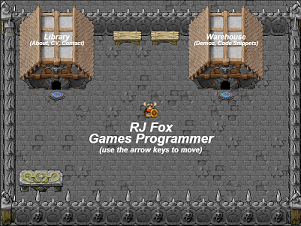

# Interactive Portfolio 2D

A portfolio site you walk around. Instead of scrolling a page, you move a character
through a small top-down town: the library holds the CV, education, skills and contact
details, and the warehouse holds the project write-ups and trailers. Walking onto a
marker opens the relevant content.

Other people on the site at the same time appear as characters walking around with you.



**Live:** <https://richy321.github.io/InteractivePortfolio2D/> and
<http://www.rjfox.co.uk>

## Running it locally

There is no build step. Serve the folder over HTTP - opening `index.html` from the
filesystem will not work, because the popups load pages into iframes:

```
python3 -m http.server 8000
```

Then <http://localhost:8000/index.html>.

## How it is put together

Plain JavaScript against a 2D canvas. No framework, no bundler, no dependencies to
install - the only third-party code on the page is Bootstrap, for the navbar.

| Path | What it is |
| --- | --- |
| `index.html` | The page: navbar, canvas, footer, and the script tags in dependency order |
| `js/portfolio.js` | Globals, input, the render/simulation loop, and `init()` |
| `js/player.js` | The character: movement, collision, walk animation, path following |
| `js/grid.js`, `js/aStar.js` | The tile grid and the pathfinding behind click-to-move |
| `js/town.js`, `js/library.js`, `js/warehouse.js`, `js/house.js` | The three scenes and their triggers |
| `js/popup.js` | Modal popups, on the native `<dialog>` element |
| `js/net.js` | Multiplayer presence: other visitors' characters |
| `js/collidableObject.js`, `js/commonClasses.js`, `js/timer.js` | Shared primitives |
| `pages/` | The content shown in popups |
| `server/` | The multiplayer relay, a Cloudflare Worker |

A few things worth knowing before changing it:

- **The simulation runs on a fixed 40ms step**, driven by `requestAnimationFrame`.
  Movement is expressed per step rather than per second - the character moves `deltaX`
  pixels each update - so changing the step changes how fast the game plays.
- **The canvas is scaled by `devicePixelRatio`**, but all the drawing code works in CSS
  pixels. `canvas.width` is in device pixels and is not what you want for hit testing.
- **Multiplayer is optional and fails silently.** An unreachable relay, a full room, or
  a blank `NET_CONFIG.url` in `js/net.js` all degrade to exactly the single-player site.
  Nothing in the update or draw path waits on the network.

## Multiplayer

A Cloudflare Worker in `server/` relays position snapshots between browsers. One
Durable Object is the room; it hands out a display name and a colour and passes
snapshots along, and does nothing else. Clients send at 10Hz and draw everyone else
150ms in the past, interpolating between snapshots.

```
cd server
npm install
npx wrangler dev        # local relay on ws://localhost:8787/ws
npx wrangler deploy     # deploy; put the address in NET_CONFIG.url in js/net.js
```

`server/README.md` has the protocol and the limits. `MULTIPLAYER.md` has the fuller
picture: architecture, deployment, what is and is not verified, and what is left.

## Tests

Three suites under `server/test/`, driving real browsers and real WebSocket
connections rather than mocks:

```
cd server/test
npm install
npx playwright install chromium
npm test
```

They need the site served on port 8000 and a relay on 8787. See
`server/test/README.md`.

## Deployment

- **GitHub Pages** serves `master` automatically.
- **www.rjfox.co.uk** is uploaded over FTP by hand.
- **The worker** is deployed separately with `wrangler deploy`, and is unaffected by
  either of the above.
